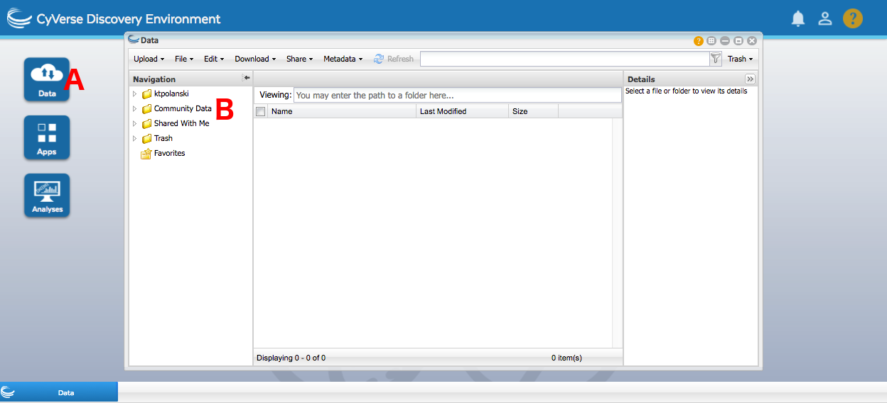
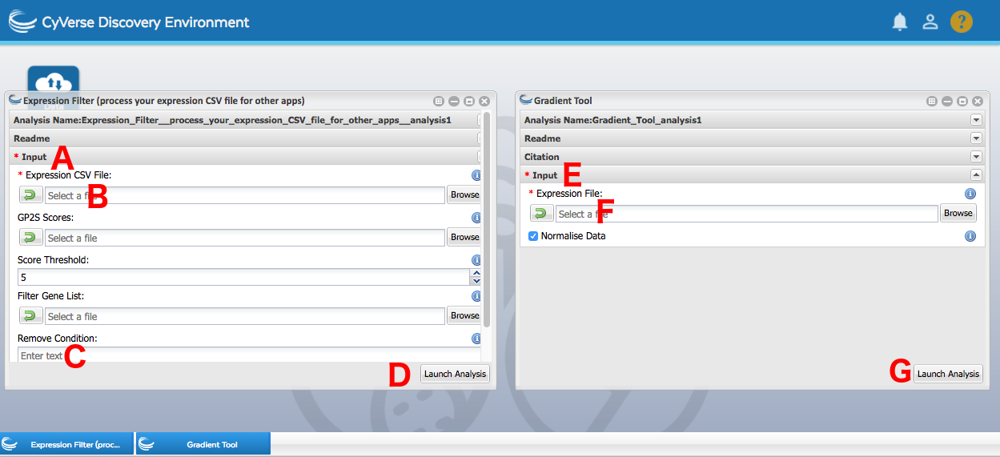

# Time Course Expression Data Pipeline Tutorial

## The Purpose of the Tutorial

This page will offer a step by step guide of a basic analysis of time course expression data using tools available within CyVerse, plus two brief sessions in Cytoscape. Similar steps can be taken to obtain a solid analysis skeleton for any time course expression data, with the obtained results serving as a good foundation for further data mining to draw appropriate biological conclusions.

## The Apps

All of the tools that we'll be using during the tutorial are housed within user-friendly apps. We'll just have to provide some data and parameters into their graphical user interfaces.

To locate the apps, open the Apps window by pressing the Apps button **(A)**. You can then find any app requested by the tutorial by clicking the Search Apps field **(B)** and writing the specified name. Press enter, and click the app that's found **(C)**.

Once an analysis is submitted, you'll be notified when it finishes by the bell in the upper right corner of the screen **(A)**. You can check on its status by either pressing the resulting notification or going into Analyses **(B)**. From there, you can click on the analysis name **(C)** to be taken directly to the output folder. Alternately, you can find the output folder by opening a Data window, going into the folder with the same name as your username, and then going into analyses and finding the folder with the name matching the name you gave the analysis when launching it.

## The Data

For the purpose of the tutorial, we will use a small expression input file to make the individual analyses complete in a timely manner. The data at hand will be 250 randomly chosen genes from a 24 time point microarray time course documenting Arabidopsis response to *Botrytis cinerea* infection, along with a control experiment. The complete experiment analysis, along with the drawn conclusions, can be found in [Windram et al., 2012][windram2012]. Reading that article can serve as an example on how to identify and perform follow-up analyses building on the core of the workflow.

The expression data can be found at `iplantcollaborative/example_data/cyverseuk/expression_tutorial/data.csv` under Community Data. To access this, open up a Data window by pressing the Data button **(A)**. Then press Community Data **(B)** and navigate the folder hierarchy until you get to the right folder. Disclaimer - CyVerse sorts its folder names in a slightly unusual fashion, with folders starting with lower case letters only showing up after the folders that start with higher case letters. You can drag files directly out of a Data window into an app.

The discussed workflow can also be performed for RNA-Seq data, but due to assumptions made by the algorithms the data has to be log-transformed to make its distribution closer to normal. This option is offered by the expression filter app mentioned later in the tutorial.

## Differential Expression

While the demonstration analysis uses only 250 profiles, a complete time course expression dataset is going to feature tens of thousands of genes, making the reduction of this scope an absolute necessity to draw sensible conclusions from the data. As such, the logical first step is to perform differential expression analysis and only focus on differentially expressed genes in subsequent steps.

In this step, we'll perform differential expression analysis using two different apps - GP2S and the gradient tool. We will compare the results we obtain, and draw conclusions on the importance of using the appropriate tool to match the data at hand. At the end of the step, we'll have a list of differentially expressed genes and a filtered expression file to use during later stages of the workflow.

### GP2S

GP2S is a differential expression algorithm for data collected across two conditions. The method fits a model to all data together, regardless of which condition it's from, and compares the quality to how well the data is described by a single model per condition. Seeing how our data features both a control and a treated time series, it's a good fit for the algorithm. In fact, this method was used for differential expression analysis in the article.

For details, consult [the documentation][gp2s].

To perform a GP2S analysis:

1. Locate and open the GP2S app using the search bar at the top of the apps window.
2. Under General Input **(A)**, provide the initial expression data (`iplantcollaborative/example_data/cyverseuk/expression_tutorial/data.csv` under Community Data) into the Expression CSV File field **(B)**.
3. Feel free to leave the other parameters as default. Press Launch **(C)**.
4. Once the analysis completes, download `FullOutput.tar` from the results folder to your machine and extract it.
5. Go to the plots folder and take a look at the plots. The name of each individual plot file is the analysed gene, while the title line of the plot contains information on the Bayes Factor score assigned to it based on the models. The blue model is the one fit to all the data at once, while the red and green are two individual fits for each condition separately. The higher the score, the more confident the algorithm is the gene is differentially expressed. Around what score value do you start seeing visually discernible differential expression?
6. Select a score cutoff for differential expression. The documentation recommends a value between 3 and 10. Combine this suggestion with the conclusions you drew from looking at the plots and pick a value. The rest of the analysis has been tested with a cutoff of 5.
7. Locate the Expression Filter app using the search bar at the top of the apps window.
8. Under Input **(D)**, provide the initial expression data (`iplantcollaborative/example_data/cyverseuk/expression_tutorial/data.csv` under Community Data) into the Expression CSV File field **(E)**.
9. Under Input, provide the `scores.txt` file produced by GP2S in the GP2S Scores field **(F)**.
10. Under Input, provide the score cutoff you settled on in the Score Threshold field **(G)**. The default value of 5 is there just as a guideline. Press Launch **(H)**.
11. Once the analysis completes, go into the results folder and rename the created `FilteredOutput.csv` to a name of your choosing. This is needed so that further filtering of the data can be performed in later steps.

Once the expression filter analysis completes, you will have an expression file with just the differentially expressed genes in it. This is the file that will be used on input for analyses in subsequent stages of the workflow.

### Gradient Tool

The gradient tool is a method for datasets that only feature a single condition. Some experimental setups make it impossible to have a control, with an example being measurements on the ageing of plant leaves ([Breeze et al., 2011][breeze2011]). In cases like those, the gradient tool observes the trends in the rate of change of expression across time, and pinpoints time points at which regulatory events begin.

This is not the correct method to use for the data at hand, but this section of the tutorial will apply it nevertheless and proceed to stress the importance of appropriate method selection for any analysis at hand. Additionally, regardless of the validity of the obtained results, this allows for a brief introduction to the gradient tool in case it turns out to be of use in the future.

For details, consult [the documentation][gradienttool].

To perform a gradient tool analysis:

1. Filter down the dataset to just the treated data. Locate the Expression Filter app using the search bar at the top of the apps window.
2. Under Input **(A)**, provide the initial expression data (`iplantcollaborative/example_data/cyverseuk/expression_tutorial/data.csv` under Community Data) into the Expression CSV File field **(B)**.
3. Type in `Control` under Remove Condition **(C)**. Press Launch **(D)**.
4. Locate and open the Gradient Tool app using the search bar at the top of the apps window.
5. Under Input **(E)**, provide the `FilteredOutput.csv` file created by the Expression Filtered app in step 1 under the Expression File field **(F)**. Press Launch **(G)**.
6. Once the analysis completes, download `FullOutput.tar` from the results folder to your machine and extract it.
7. Open `out.pdf` and take a look at the models fit and the obtained regulatory phenomenon timing trends. You may have to scroll deeper down in the file, as the plots are sorted on how dynamic the gradient is. Do you see the information loss, in comparison to GP2S? Compare AT1G68850's performance in GP2S and the gradient tool.
8. Occasionally, using the gradient tool may still be desired for datasets with a control and a treated time course. In that case, it is preferable to compute the mean for each of the conditions (single value per time point) and then obtain a difference between the two at each time point. The gradient tool can then be used to analyse the difference profile for trends. This is not part of the tutorial, but should be kept in mind for potential future application if other methods prove unsatisfactory

None of the files created within this section of the analysis are going to be used by subsequent algorithms. The comparison of fits should have stressed the importance of using methods that are appropriate for the data they are analysing.

## Clustering

Now that we have obtained a set of differentially expressed genes with GP2S, we can carry on with the analysis. Typically, the differential expression step goes a long way towards reducing the dimensionality of the data, with the number of genes that you now have to consider going down to the order of thousands instead of tens of thousands. That is still a very large space to examine, and traversing it all by hand and looking for relevant regulatory phenomena would be close to impossible. As such, a common second analysis step is clustering, which leads to genes exhibiting similar behaviour being grouped together. Clumping thousands of differentially expressed genes into a few dozen groups makes analysing them considerably easier.

In this step, we'll apply two different clustering methods to the differentially expressed gene set we obtained in the last step. This will provide insight into what regulatory trends are captured in the data, with the two algorithms extracting different information from the data. At the end of the step, we'll have a small number of gene groups to perform data mining on.

### Data Preprocessing

While the differential expression analysis made active use of the control information, clustering focuses on the behaviour of genes in the treated time course. As such, before we begin, we need to filter out the control data from the expression file.

To filter out the control data:

1. Locate the Expression Filter app using the search bar at the top of the apps window.
2. Under Input **(A)**, provide the differentially expressed gene expression data (the renamed `FilteredOutput.csv` file created in the GP2S section of the tutorial; it is important you rename this file prior to the analysis or the app will return no results) into the Expression CSV File field **(B)**.
3. Type in `Control` under Remove Condition **(C)**. Press Launch **(D)**.

### BHC

BHC is a Bayesian hierarchical clustering algorithm which starts off with all the genes in their own separate clusters and iteratively merges the most fitting pair of clusters until all genes are in one huge cluster. It then automatically determines where to cut off this cluster hierarchy, producing a set of gene groups best differentiating the different regulatory events taking place.

For details, consult [the documentation][bhc].

To perform a BHC analysis:

1. Locate the BHC app using the search bar at the top of the apps window.
2. Under Input **(A)**, provide the treated-only differentially expressed gene expression data (`FilteredOutput.csv` created in the Data Preprocessing subsection) into the Expression CSV field **(B)**.
3. Select "Squared Exponential Covariance (Time Course)" from the Run Mode dropdown **(C)**. Press Launch **(D)**.
4. Once the analysis completes, download `FullOutput.tar` from the results folder to your machine and extract it.
5. Take a look at the clustering heatmap (`heatmap.png`), which shows the established clustering hierarchy and captures the determined cutoff. If the lines of the dendrogram are solid, the clustering steps were deemed acceptable and stayed in the final output. If the lines are dashed, the algorithm determined that the clustering step is detrimental to the quality of the output and left it out. A number of the clusters are singletons (just one gene in them). Any idea why?

In this step, we performed basic co-expression clustering using a hierarchical clustering approach. We obtained a list of clusters with genes in them. A lot of the clusters just had a single gene in them, which stems from the fact we're working on a small data sample and some of the 250 randomly selected profiles didn't match other expression profiles enough to become clustered together.

### TCAP

TCAP is a slightly different approach to BHC, as it uses a more complex distance measure. This results in the clusters it produces capturing more intricate regulatory interactions, such as time shifts or inverted trends. These richer gene groups form an interesting alternative to typical co-expression approaches by capturing broader groups of responses likely to be induced by the same upstream regulatory phenomenons.

For details, consult [the documentation][tcap].

To perform a TCAP analysis:

1. Locate the TCAP app using the search bar at the top of the apps window.
2. Under Input **(A)**, provide the treated-only differentially expressed gene expression data (`FilteredOutput.csv` created in the Data Preprocessing subsection) into the Expression CSV File field **(B)**.
3. Feel free to leave the other parameters as default. Press Launch **(C)**.
4. Once the analysis completes, download `FullOutput.tar` from the results folder to your machine and extract it.
5. Take a look at the cluster plots in the plots folder. Do you see any regulatory interactions more complex than basic co-expression being captured by the modules? Do singleton clusters still occur? How does their rate compare to those produced by BHC? Any ideas for why this might be happening?

In this step, we used a more complex similarity measure to obtain clusters with more regulatory depth. Said clusters still featured some singletons, but less so than the prior clustering. This can stem from the change in the distance metric and its broader regulatory phenomenon palette, potentially sweeping some genes previously not clustered into a cluster with a different function than plain co-expression. We'll be using the TCAP clusters for enrichment analysis in the following step.

## Enrichment Analysis

By now, we have successfully reduced the scope of our analysis to something we can actually handle with ease. Filtering the genes to ones that are differentially expressed, and then clustering them leads to a small set of gene groups to analyse to get some idea of what is actually going on in the data. A common form of analysis used to extract this sort of information from the gene groups is known as enrichment analysis, and boils down to assessing whether particular traits representative of functionality are overrepresented in any individual gene group. The traits that are often tested this way are Gene Ontology (GO) terms, binding sites for transcription factors, and genes involved in particular signalling pathways.

In this step, we'll analyse the TCAP clusters we created with BiNGO, HMT and MEME\_LaB. BiNGO is a GO term analysis tool, shedding light on the functionality of clusters, while the other two analyse transcription factor binding sites in the genes' promoters. HMT uses known, well defined motifs while MEME\_LaB performs a *de novo* scan to identify the top overrepresented motifs, regardless of whether they're characterised or not. At the end of the step, we'll have gained some insight on what processes were captured in the clusters.

### Filtering Out Singleton Clusters

Clusters with a single gene in them don't carry much relevant information when performing overrepresentation analyses, and are in fact actively disliked by some of the methods (MEME-LaB). As such, before we begin, we're going to remove all singleton clusters from our cluster list

To filter out singleton clusters:

1. Open the TCAP output folder you downloaded to your local machine.
2. Go to the `functional_analysis_inputs` folder. `bingo.txt` features the clusters formatted in a BiNGO-friendly manner, while `meme.txt` features clusters formatted in a format HMT and MEME-LaB understand.
3. Open up `bingo.txt` in a text editor. You'll notice that each cluster in the file starts with a line beginning with `>Cluster`, then has one line per gene ID in the cluster, then ends with the word `batch`. Locate all the clusters with a single gene and remove all their lines from the file.
4. Repeat this procedure with `meme.txt`. This time around, the clusters are formatted into two columns, with the first column being the cluster number and the second column being the gene ID. Locate all the clusters with just one gene in them and delete them from the file. They should have the same numbers as the clusters you deleted from `bingo.txt`.
5. While we'll use `bingo.txt` locally, our motif analysis apps are on CyVerse. As such, we need to upload `meme.txt` back to CyVerse. Open up the Data tab of CyVerse, click on Upload in the top left corner, pick Simple Upload from Desktop, navigate to `meme.txt` on your computer and press Upload.

### BiNGO

BiNGO is a Cytoscape plug-in that allows for the analysis of the overrepresentation of GO terms in specified gene groups. GO terms are a computationally friendly manner of capturing functionality that can be used to annotate genes with increasingly specific information on their role. GO terms form a tree, with the branching leading towards more and more specific regulatory functions. However, no matter how particular a single GO term may be, following the path back to the root gets all the terms from the passed banches as well. BiNGO traverses this landscape to identify the terms overrepresented in the supplied gene groups using simple statistical testing.

To perform a BiNGO analysis:

1. If you don't have it already, set up Cytoscape on your machine. Go to http://www.cytoscape.org/download.php and download the recommended installer. Then us it to install Cytoscape.
2. Open Cytoscape.
3. Set up BiNGO. Go to http://apps.cytoscape.org/apps/bingo and press the Install button. This will automatically set up the app within your Cytoscape environment.
4. Open the Apps dropdown in the Cytoscape menu bar and open BiNGO.
5. Prepare BiNGO for analysing your clusters. For Cluster Name **(A)**, type in batch. Check Paste Genes from Text **(B)**, as that's what we'll do shortly. Check No Visualisation **(C)** instead of Visualisation. Select the ontology file to be GO\_Full **(D)**. Select the organism/annotation to *Arabidopsis thaliana* **(E)**.
6. Load in your TCAP clusters. TCAP, and all the other clustering apps on CyVerse UK, automatically produce a BiNGO-friendly form of their clusters. Locate the TCAP output you downloaded to your computer earlier (and removed singleton clusters from), open up the `functional_analysis_inputs` folder and open `bingo.txt` in a text editor of some sort. Copy its contents and paste them into the field underneath the checked Paste Genes from Text box **(F)** in BiNGO. Then press backspace, as BiNGO sometimes randomly hangs if the last line of input is empty. Press Start BiNGO **(G)**.
7. Once the analysis completes, take a look at the identified GO terms for your clusters. Does each cluster get to have GO terms? What sort of GO terms are identified? What happens with the singleton clusters?

As with the clustering, the results of the GO term analysis are warped because the dataset we are analysing is but a small random sample of genes instead of the whole phenomenon. When performing this analysis with a GP2S score threshold of five, one of the clusters has a "response to fungus" GO term, which is expected as the stimulus we are exposing Arabidopsis to is indeed a fungus. If you're interested in finding out what the overrepresented functionality is in the full dataset, refer to [Windram et al., 2012][windram2012].

### HMT

HMT uses the same exact statistical framework as BiNGO to perform a different kind of enrichment scan - for transcription factor binding motifs. By locating known transcription factor binding sites in promoters and then identifying which are overrepresented in the clusters, we get a good idea of which transcription factors could be responsible for the observed regulatory phenomena. Due to improvements in experimental techniques, it's now possible to obtain binding motifs specific to individual transcription factors. For the purposes of this section, we'll use single transcription factor motifs obtained with protein binding microarrays by [Franco-Zorrilla et al.][fz2014] and [Weirauch et al.][weirauch2014].

For details, consult [the documentation][hmt].

To perform a HMT analysis:

1. Locate the HMT app using the search bar at the top of the apps window.
2. HMT typically requires a preliminary run of your motifs through its helper app HMT\_index, but this takes some time to process. Due to temporal constraints of the tutorial, this has been precomputed and made available for you. If you wish to take a look at the inputs for HMT\_ index or re-run it yourself at a later time, you can find the used inputs in `iplantcollaborative/example_data/cyverseuk/hmt_index_testdata` under Community Data. All the parameters in the HMT\_index were left as defaults.
3. Under Input **(A)**, provide the MEME-formatted clusters generated by TCAP that you filtered singletons out of and re-uploaded to CyVerse in the Gene Group Input File field **(B)**.
4. For the Motif Hit File **(C)**, Motif PWM Logos Folder **(D)** and Gene Universe **(E)** provide `fimo_found.txt`, the folder `logos` and `universe.txt` which can be found in `iplantcollaborative/example_data/cyverseuk/hmt_testdata` under Community Data. These are the files created by the helper app HMT\_index. Press Launch **(F)**.
6. Once the analysis completes, download `FullOutput.tar` from the results folder to your machine and extract it.
7. The relevant overrepresentations after multiple testing corrections can be found in the files with names starting with `Overrepresentation_`. Are any motifs overrepresented in any of the clusters? What do the different file names mean? What happens as you increase the stringency? If in doubt, consult [the documentation][hmt].

There's barely any overrepresented motifs detected - in the case of TCAP clusters for differentially expressed genes with a GP2S score cutoff of 5, there's exactly one with a Benjamini-Hochberg correction, but even that goes away as the false discovery rate correction stringency increases to Global Bonferroni. This can be a result of many factors - the small 250 gene pool to begin with, and the relatively small (albeit highly precise) protein binding microarray motif pool. It's possible that there are overrepresented transcription factor binding motifs, just ones outside of this pool.

### MEME-LaB

MEME-LaB is also a transcription factor binding tool, but one that performs its motif minint *de novo*. It doesn't commence its analysis with any preconceived notions on what the motifs it's out to find should look like and instead reports the top overrepresented motifs for each cluster, regardless of what they look like. However, in an attempt to add some immediate interpretation to the results, the found motifs are compared against known sequences from the JASPAR database to try and shed some light on possible regulatory connotations.

For details, consult [the documentation][memelab].

To perform a MEME-LaB analysis:

1. Locate the MEME-LaB app using the search bar at the top of the apps window.
2. Similarly to HMT, MEME-LaB operates on promoter sequences of genes in the organism we're working on. However, while HMT outsources promoter mining to its helper app HMT\_index, MEME-LaB performs it within its innards. As such, we need to provide a genome sequence and GFF3 file for the app to automatically extract promoters. You can find them in `iplantcollaborative/example_data/cyverseuk/hmt_index_testdata` under Community Data, with `genome_rm.fa` going into the Genome FASTA File field **(A)** and `annot.gff3` going into the GFF3 Annotation field **(B)**.
3. Provide the MEME-formatted clusters generated by TCAP that you filtered singletons out of and re-uploaded to CyVerse in the Gene Group Input File field **(C)**. Press Launch **(D)**.
4. Once the analysis completes, download `FullOutput.tar` from the results folder to your machine and extract it.
5. Take a look at the results. Each cluster should have the same number of overrepresented motifs reported, with each motif featuring a number of statistics on its incidence rate. How do these results compare to what was found by HMT? You can find the PWM logos for the HMT motifs at `iplantcollaborative/example_data/cyverseuk/hmt_testdata/logos` under Community Data.

When ran with the same set of clusters as HMT (TCAP, GP2S threshold of 5), a motif very similar to the one located in cluster 2 (M2350_1.02) is also identified in cluster 2, as the second best motif. However, another motif is also identified in the cluster, with a higher occurrence rate. This demonstrates the strength of *de novo* motif mining, as the motif set used in HMT did not have information on this motif which might be a driving force behind the regulatory phenomena in this cluster. However, as a trade-off, we don't have any immediate information on what transcription factors may be binding to it. Also, the fact that MEME-LaB always has to report a fixed top number of motifs leads to some of the motifs being reported being possibly uninformative. As such, always check the incidence rate statistics provided when evaluating the motifs.

## Network Inference

The final part of the tutorial will see us infer a transcription factor regulatory network model to help unearth the regulatory core of the observed response. A regulatory network model is a graph, where single transcription factors take on the form of nodes and regulatory interactions are edges connecting two of the nodes. The model will be causal, i.e. the edges will have explicit directions, and the model will carry explicit information on which transcription factor is the regulator and which is the target. The network inference will be performed using CSI.

### Filtering Data

The network inference algorithm expects expression data for differentially expressed transcription factors. Unlike clustering, it doesn't mind having information from the control time series in the dataset though. As such, we'll leave the control time series in to provide additional information to the modelling algorithm.

To filter the data to include differentially expressed transcription factors:

1. Locate the Expression Filter app using the search bar at the top of the apps window.
2. Under Input **(A)**, provide the differentially expressed gene expression data (the renamed `FilteredOutput.csv` file created in the GP2S section of the tutorial) into the Expression CSV File field **(B)**.
3. Provide a list of Arabidopsis transcription factors (sourced from [Pruneda-Paz et al.][kay], `iplantcollaborative/example_data/cyverseuk/expression_tutorial/tf_list.txt` under Community Data) in the Filter Gene List field **(C)**. Press Launch **(D)**.

### CSI

Now that the data has been appropriately filtered, network inference can commence. CSI performs its inference by finding fits to data plots made from the potential regulator gene's expression values plotted against the expression values of its potential target at the subsequent time point. The better the fit, the more confident CSI is that the tested regulatory relationship is real.

For details, consult [the documentation][csi].

To run CSI and analyse its results:

1. Locate the CSI app using the search bar at the top of the apps window.
2. Under Input **(A)**, provide the differentially expressed transcription factor data we filtered out in the previous step (`FilteredOutput.csv`) into the Gene Expression CSV field **(B)**.
3. Leave all the parameters as defaults. Press Launch **(C)**.
4. Once the analysis completes, download `FullOutput.tar` from the results folder to your machine and extract it.
5. Navigate to the `html` folder and open `csi.html`. This will open a webapp to experience the resulting network model in.
6. The main controls in the webapp are the choice between MAP (best model for each target gene) and marginal (sum across all the models for a target gene) network models, which can be toggled in the network dropdown, and the Minimum Weight parameter box (the higher the value, the more rigorous the edge selection). Experiment with both of those options. What changes in the model when you alter those selections?
7. Once you reach a model you're happy with, press the File dropdown and select Export to Cytoscape. This will produce a GML file on your drive.
8. Open Cytoscape again. Import your GML file by selecting the File menu, then going to Import -> Network -> File.
9. Adjust the node layout to taste, and show the direction of the edges. In the tabs on the left, go to Style, then on the bottom go to Edge, then pick a Target Arrow shape.
10. You can also map the certainty of the interaction according to CSI, akin to what was happening in the webapp when you were selecting the model to export. In the same edge window, scroll down until you find Width. Click on the little triangle on the right side of the row to open up additional options. Under Column, pick weight. Under Mapping Type, pick Continuous Mapping. Double click the graphics in the Current Mapping field and slide around the minimum (left side) and maximum (right side) values to obtain a suitable graphical representation.

As always, remember that the model offered here is not heavily biologically conclusive due to the reduced gene pool, but rather serves as a guideline of what the method can offer given a proper data set. The MAP model only takes the best fit for any given target gene, leading to a lot of information loss. The marginal model sums across all the fits that were tested, accounting for the quality of each, but in turn leads to more crowded models. Also, whilst the webapp is a handy tool, it would be very hard to browse models featuring hundreds of genes in it. As such, a helper app by the name of hCSI\_MarginalThreshold is capable of making a GML file of your model given the MAP/marginal CSV file produced by CSI along with a minimum weight, like the webapp.

## That's It!

With that, we have arrived at the end of the tutorial. We started out from raw expression data after normalisation, but with no information whatsoever on what was lurking within. We performed a differential expression analysis to decrease the scope of the gene space to analyse. We then performed two different kinds of clustering, one of the methods using a rich similarity measure, and got gene groups which were likely to be driven by the same regulatory phenomena. We then analysed those gene groups for function, using GO terms, and sources of regulation, comparing *de novo* and known motif analysis tools. Finally, we constructed a regulatory network model for differentially expressed transcription factors, obtaining the regulatory core driving the observed phenomena. All of this was performed using CyVerse apps, with a brief excursion to Cytoscape for GO term analysis and network visualisation. Whilst none of the reached biological conclusions are particularly relevant due to the fragmentary nature of the input data for computational throughput, we hope that you've found this relevant and may use some of the algorithms in your research.

[breeze2011]: http://www.plantcell.org/content/23/3/873.full
[windram2012]: http://www.plantcell.org/content/24/9/3530.short
[gp2s]: https://github.com/cyversewarwick/gp2s
[gradienttool]: https://github.com/cyversewarwick/gradienttool
[bhc]: https://github.com/cyversewarwick/bhc
[tcap]: https://github.com/cyversewarwick/tcap
[hmt]: https://github.com/cyversewarwick/hmt
[csi]: https://github.com/cyversewarwick/csi
[memelab]: https://github.com/cyversewarwick/meme_lab
[fz2014]: http://www.pnas.org/content/111/6/2367.short
[weirauch2014]: http://www.cell.com/cell/abstract/S0092-8674(14)01036-8?_returnURL=http%3A%2F%2Flinkinghub.elsevier.com%2Fretrieve%2Fpii%2FS0092867414010368%3Fshowall%3Dtrue&cc=y=
[kay]: http://www.sciencedirect.com/science/article/pii/S2211124714005178